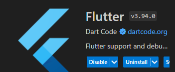
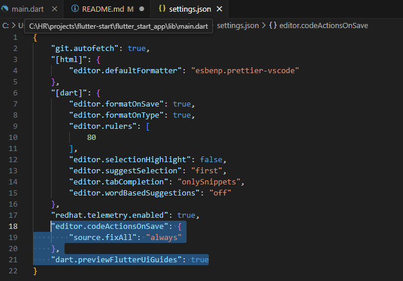
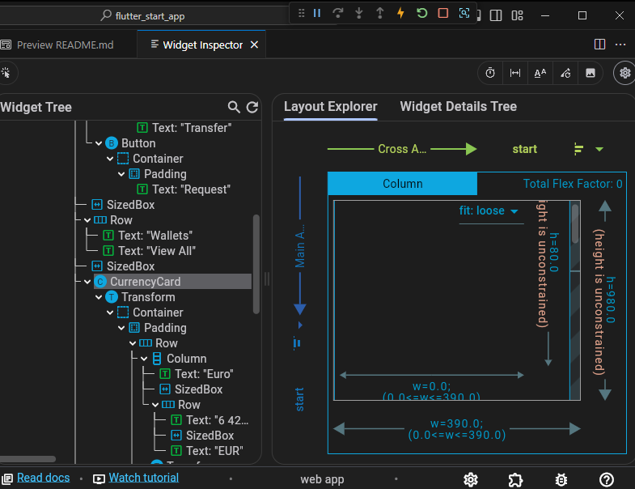
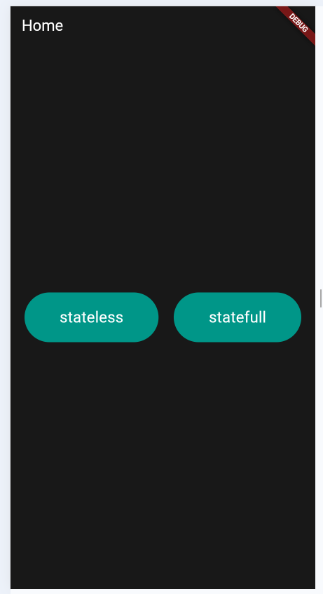
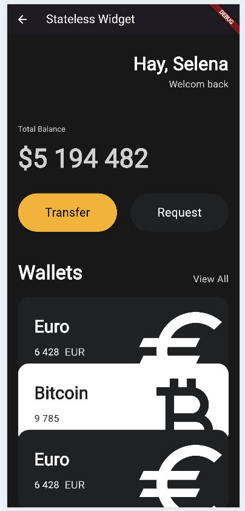
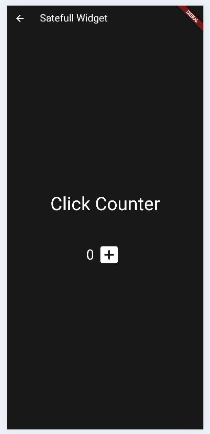

# flutter_start_app

1. 플러터 환경 구성, flutter devtools 사용법, 유용한 편집기 설정
2. stateless widget 만들기
3. statefull widget 만들기
4. 재사용할 stateless widget 만들기

## Flutter 환경 구성
- 설치: https://docs.flutter.dev/get-started/install  
\* windows 에서 안드로이드 설정은 매우 복잡하기 때문에 크롬의 device toolbar 사용 추천

- vscode 환경 구성
    1. 플러그인 설치  
    : flutter 플러그인 다운로드 시 Dart 플러그인도 같이 다운로드 해줌
    
    2. 편집기 추천 설정   
    : Ctrl + Shift + P > "Open User Settings (JSON)" > 아래와 같이 설정 추가
    
    3. devtools 사용  
    : Widget 구성을 쉽게 파악할 수 있고, 세부 내역 확인 가능
    

## 실행 화면
|main|stateless|statefull|
|:---:|:---:|:---:|
| |  | 

## 참고
[Flutter 공식 페이지](https://docs.flutter.dev)
[노마드코더-플러터로 웹툰 만들기](https://nomadcoders.co/flutter-for-beginners)
